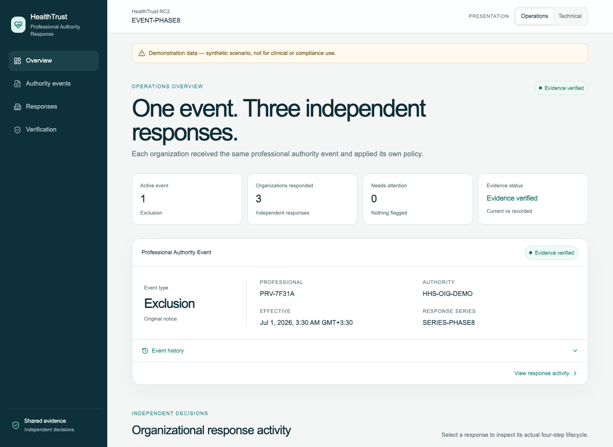
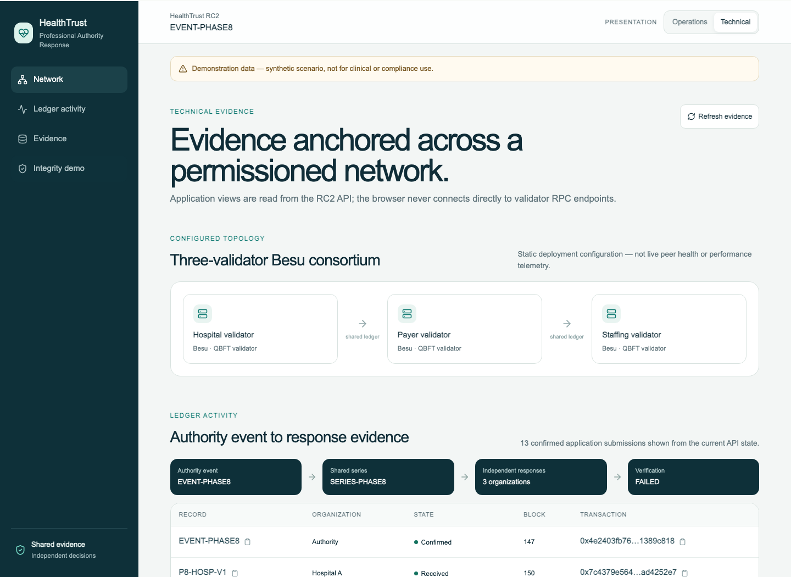
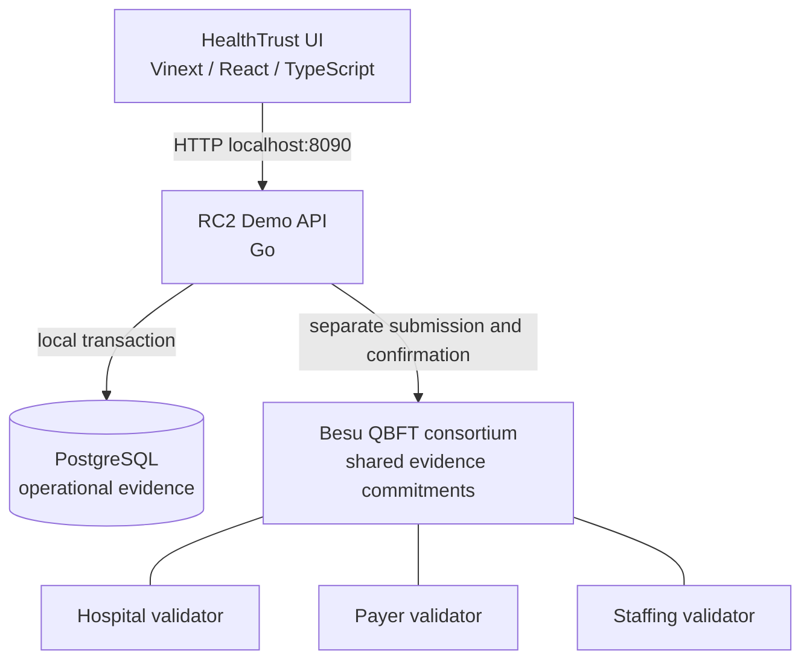

# HealthTrust Exchange

**HealthTrust — Professional Authority Response Ledger**

HealthTrust RC2 is an engineering reference implementation exploring how
multiple healthcare organizations could share independently verifiable evidence
about professional-authority events while retaining independent authority over
their own operational responses.

> **Shared evidence does not mean shared decisions.**

RC2 asks: **When organizations need the same evidence but must retain independent
authority, is distributing trust worth the added complexity?** It explores that
question through a bounded, synthetic demonstration; it does not claim to answer
it commercially or operationally.

## RC2 — Professional Authority Response Ledger

The deterministic scenario begins with one synthetic exclusion assertion from
`HHS-OIG-DEMO` about pseudonymous subject `PRV-7F31A`. Hospital A, Payer B, and
Staffing Agency C see evidence of the same event, then apply separate local
policies and record separate responses.

```text
Synthetic professional-authority event
  → verified ingestion and persisted evidence
  → shared consortium evidence
  → independent organizational responses
  → recorded evidence commitments
  → integrity verification
  → controlled local change
  → detectable inconsistency
```

All identities, records, policies, outcomes, accounts, and infrastructure in the
demo are synthetic.

## What the demo shows

| Organization | Synthetic outcome |
| --- | --- |
| Hospital A | Scheduling disabled |
| Payer B | Enrollment/reimbursement held |
| Staffing Agency C | Assignment ended |



| Technical evidence | Integrity mismatch |
| --- | --- |
|  |  |

These labels are a bounded presentation projection, not validated production
terminology. The shared network records evidence; it does not choose or coordinate
the organizations' actions.

The integrity demonstration first verifies that current PostgreSQL evidence
matches previously recorded ledger evidence. It then uses an explicit demo-only
operation to change one allowlisted Hospital A policy field. The database change
is allowed and the prior ledger evidence is not rewritten, so the mismatch becomes
detectable. Payer B and Staffing Agency C remain verified.

`VERIFIED` means current canonical evidence matches previously recorded evidence.
It does not prove that the original data was true. `FAILED` means the current and
recorded evidence differ; it does not identify who changed the data or which value
is correct.

## Architecture



The browser communicates with the Go API, never directly with Besu. PostgreSQL is
the operational system of record. Besu records bounded pseudonymous identifiers,
lineage, state, timestamps, and SHA-256 canonical commitments—not sensitive policy
text or operational detail.

PostgreSQL and Besu writes are **not atomic**. The application first persists the
domain version and `LOCAL_PENDING` submission intent in one PostgreSQL transaction,
then submits separately to Besu. Durable submission state and reconciliation close
recoverable failure windows without pretending the two systems form one distributed
transaction.

Application transaction signers are distinct from QBFT validator identities.

### Technical summary

- **Frontend:** Vinext, React, and TypeScript
- **Backend:** Go
- **Operational persistence:** PostgreSQL
- **Shared evidence ledger:** Hyperledger Besu with QBFT consensus
- **Contracts:** Solidity
- **Integrity:** versioned SHA-256 canonical commitments
- **Testing:** Go unit/integration/race checks, Solidity contract tests, frontend
  tests, and real Playwright browser E2E

## Quick start

### Prerequisites

- Docker with Docker Compose
- Git, `curl`, and Python 3
- Node.js 22.13 or newer with npm
- Available browser-facing ports `3000` and `8090`
- Available loopback infrastructure ports `5434`, `8545`, `8546`, and `8547`

Go 1.23 or newer is required only for running backend checks outside Docker. No
local Foundry installation is required; the contract helper uses its pinned Docker
image.

From the repository root, recreate the disposable RC2 environment, start its
infrastructure, deploy the contracts, and start the demo API with the bounded
integrity operation enabled:

```sh
docker compose -f docker-compose.rc2.yml --profile demo-api down --volumes --remove-orphans
docker compose -f docker-compose.rc2.yml --profile demo-api up -d --wait \
  rc2-postgres besu-hospital-validator besu-payer-validator besu-staffing-validator
./contracts/scripts/deploy-local.sh
HEALTHTRUST_RC2_DEMO_TAMPER_ENABLED=true \
  docker compose -f docker-compose.rc2.yml --profile demo-api \
  up -d --build --wait rc2-demo-api
curl --fail http://localhost:8090/readyz
```

In a second terminal:

```sh
cd web
npm ci
npm run dev
```

Open `http://localhost:3000/authority`.

| Port | Exposure | Purpose |
| --- | --- | --- |
| `3000` | Browser-facing | HealthTrust frontend |
| `8090` | Browser-facing, loopback | RC2 demo API |
| `5434` | Loopback infrastructure | PostgreSQL test/admin access |
| `8545`–`8547` | Loopback infrastructure | Three Besu validator RPC endpoints |

Do not configure the browser to use the PostgreSQL or Besu ports.

## Demo walkthrough

1. Open the authority workspace and identify the synthetic exclusion event.
2. Compare the three independently chosen organizational outcomes.
3. Confirm that the initial evidence status is `VERIFIED`.
4. Switch from **Operations** to **Technical** and inspect transaction, block, and
   canonical commitment evidence.
5. Open **Integrity Detection**, choose **Simulate local policy change**, and read
   the warning.
6. Confirm the bounded change.
7. Observe Hospital A become `FAILED` while Payer B and Staffing Agency C remain
   `VERIFIED`.
8. Refresh the browser: the result remains because it is persisted backend state.

Use the [RC2 demo runbook](docs/rc2/DEMO_RUNBOOK.md) for presenter notes, preflight
checks, cleanup, recovery, and a 30-second or 3–5 minute narrative.

## Demo state and reset

The fixed fixture IDs make the demo deterministic, but a successful controlled
change persists in PostgreSQL. Browser refresh and API restart intentionally do
not repair it. There is no reset or repair API.

To return to a clean `VERIFIED` state, stop the frontend and recreate only the
disposable RC2 Compose environment:

```sh
docker compose -f docker-compose.rc2.yml --profile demo-api down --volumes --remove-orphans
```

Then repeat the Quick Start. This deletes the local RC2 PostgreSQL and Besu demo
history. It does not touch the separate RC1 Compose environment.

## Testing

Backend, from the repository root with Go 1.23 or newer:

```sh
go vet ./...
go test -count=1 ./...
go test -count=1 -race ./...
```

Solidity contracts (runs Foundry in Docker):

```sh
./contracts/scripts/forge.sh test
```

Frontend, from `web/` with Node.js 22.13 or newer:

```sh
npm ci
npm run lint
npm run typecheck
npm test
npm run build
```

With a clean, mutation-enabled RC2 API and the frontend already running:

```sh
cd web
E2E_BASE_URL=http://localhost:3000 \
  npx playwright test e2e/rc2-real-hero.spec.ts
```

The hero test performs the controlled change. Recreate the disposable environment
before repeating it. The destructive runtime smoke test, which also recreates RC2
volumes, is available as `./scripts/rc2-runtime-smoke.sh`.

## Repository structure

```text
cmd/rc2-demo-api/             RC2 executable composition
contracts/                    Solidity contracts, tests, and deployment helper
docs/rc2/                     RC2 design, security, runtime, and demo documents
infra/besu/                   local three-validator QBFT configuration
internal/application/         authority workflow and integrity application services
internal/evidence/canonical/  versioned canonical SHA-256 commitments
internal/ledger/              ledger boundary and Besu adapter
internal/persistence/         PostgreSQL repositories
internal/rc2runtime/           deterministic synthetic bootstrap
migrations/authority_ledger/  isolated RC2 PostgreSQL schema
scripts/                      runtime validation helpers
web/                          Vinext/React UI, frontend tests, and Playwright E2E
```

## RC1 history

RC1 is the broader two-hospital healthcare data-exchange prototype: clinical
records, referrals, patient consent, cross-hospital retrieval, and a custom
permissioned chain. RC2 intentionally narrows the research surface to
professional-authority evidence and independent organizational responses, using
PostgreSQL plus Hyperledger Besu/QBFT.

RC1 remains preserved by the `rc1` Git tag. Its historical
[architecture](docs/ARCHITECTURE.md), [security model](docs/SECURITY.md), and
[demo script](docs/DEMO.md) describe RC1, not the RC2 runtime.

## Security, privacy, and non-claims

- The demo uses synthetic data only; do not use PHI or real practitioner data.
- Sensitive source documents, policy text, explanations, reviewer/operator
  references, and supporting evidence remain off-chain.
- Private keys are not exposed to the browser. Checked-in deterministic demo keys
  are public test material and must never be reused.
- The controlled mutation endpoint is bounded, synthetic, explicitly enabled, and
  demo-only. The Technical view is observability, not administration.
- `ResponseLedger` has no separate aggregate `ResponseV1` commitment. The Hospital
  A integrity demonstration compares recomputed `PolicyV1` evidence with the
  policy commitment in the recorded response snapshot.

This is a single-host local consortium with deterministic infrastructure. It has
no production authentication/RBAC, secrets management, network hardening,
organizational infrastructure independence, practitioner validation, real OIG
integration, regulatory certification, or market validation. It does not prove
blockchain is necessary, evidence is truthful, mutation is prevented, downstream
actions occurred, or an actor can be forensically identified. It is not a
production healthcare product, credentialing replacement, or compliance solution.

## RC2 documentation

- [Architecture plan](docs/rc2/ARCHITECTURE_PLAN.md)
- [Migration strategy](docs/rc2/MIGRATION_STRATEGY.md)
- [Canonicalization](docs/rc2/CANONICALIZATION.md)
- [Threat model](docs/rc2/THREAT_MODEL.md)
- [State machines](docs/rc2/STATE_MACHINES.md)
- [Persistence](docs/rc2/PERSISTENCE.md)
- [Submission lifecycle](docs/rc2/SUBMISSION_LIFECYCLE.md)
- [Reconciliation](docs/rc2/RECONCILIATION.md)
- [Phase 5 validation](docs/rc2/PHASE5_VALIDATION.md)
- [Application workflow](docs/rc2/APPLICATION_WORKFLOW.md)
- [Integrity verification](docs/rc2/INTEGRITY_VERIFICATION.md)
- [Controlled tamper demo](docs/rc2/CONTROLLED_TAMPER_DEMO.md)
- [Demo runtime](docs/rc2/DEMO_RUNTIME.md)
- [Response presentation projection](docs/rc2/RESPONSE_PRESENTATION_PROJECTION.md)
- [Frontend demo UX](docs/rc2/FRONTEND_DEMO_UX.md)
- [Presenter runbook](docs/rc2/DEMO_RUNBOOK.md)

## License

No license has been selected. All rights remain with the repository owner unless a
license is added.
