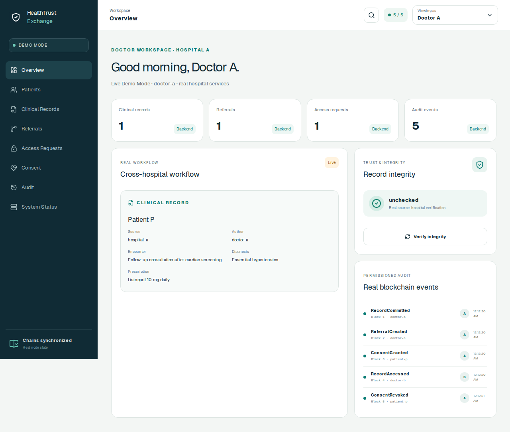
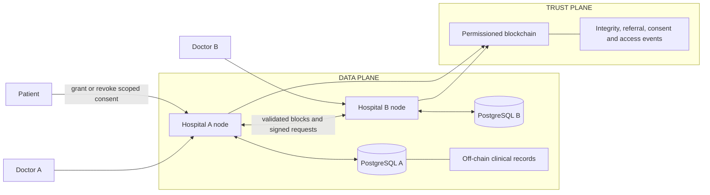
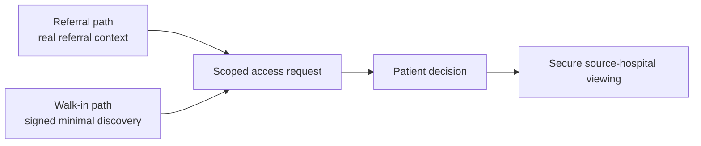
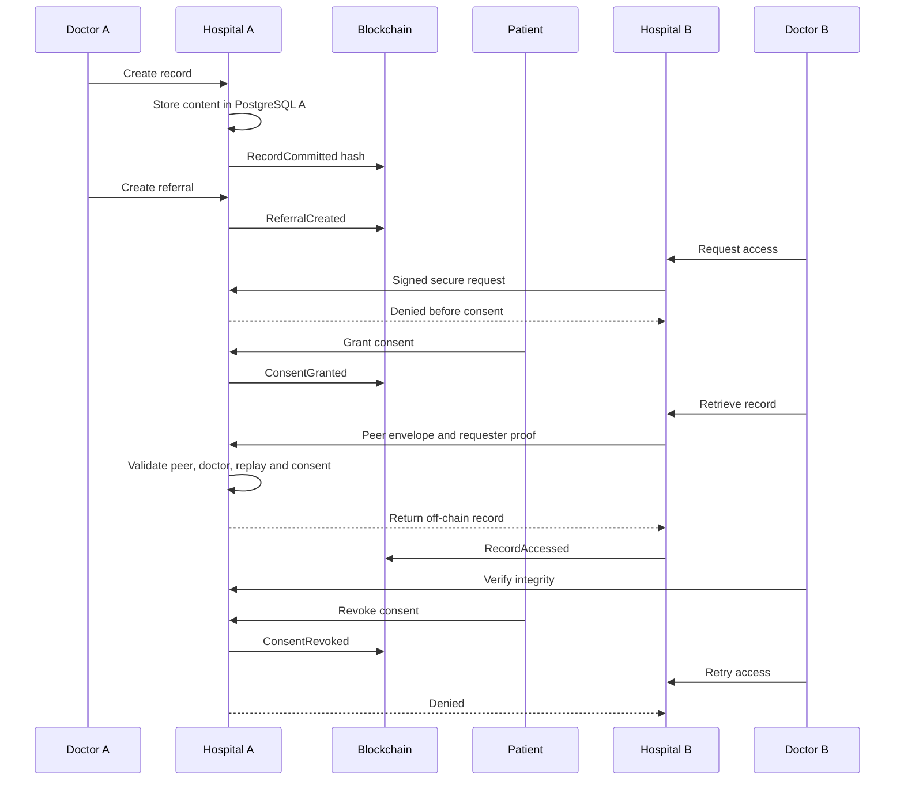
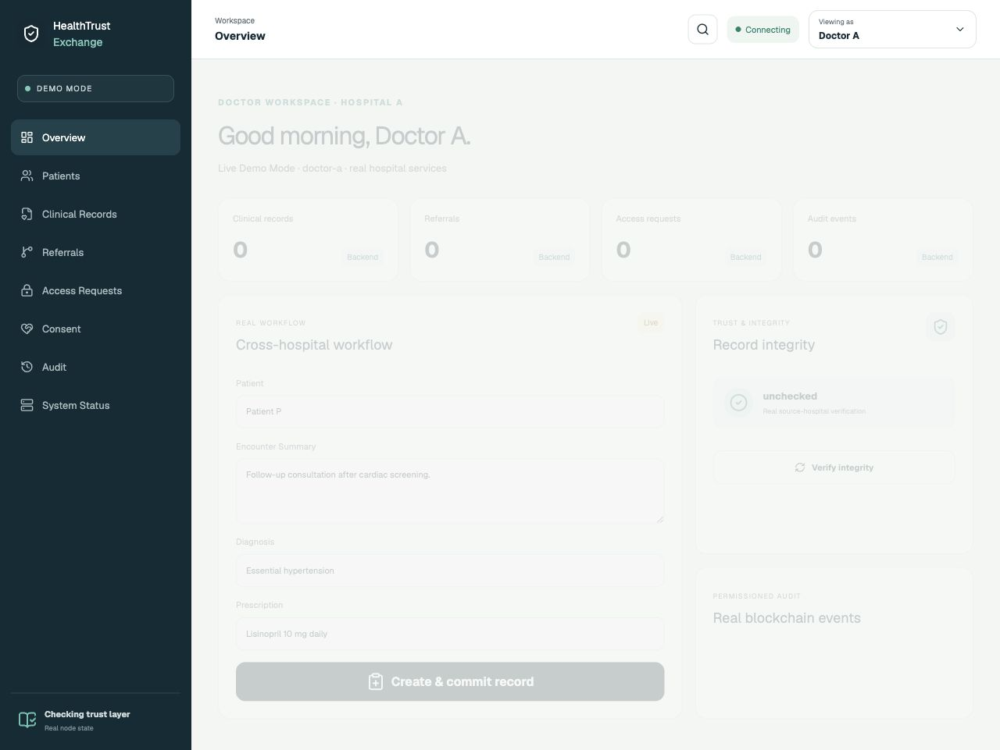
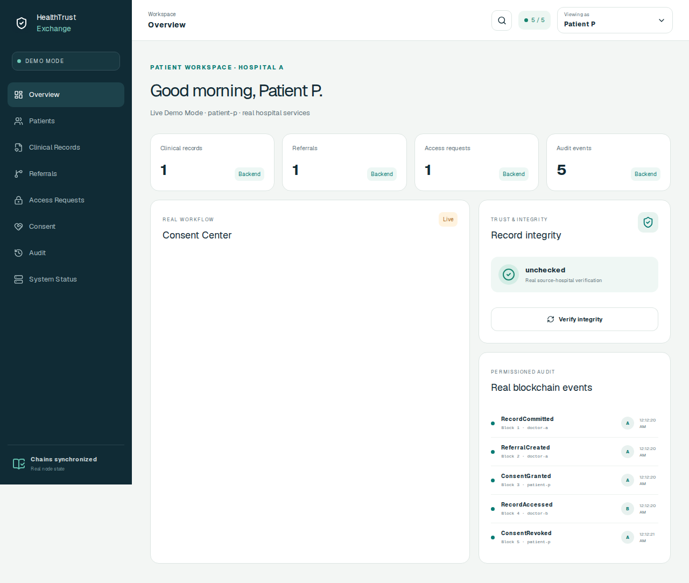
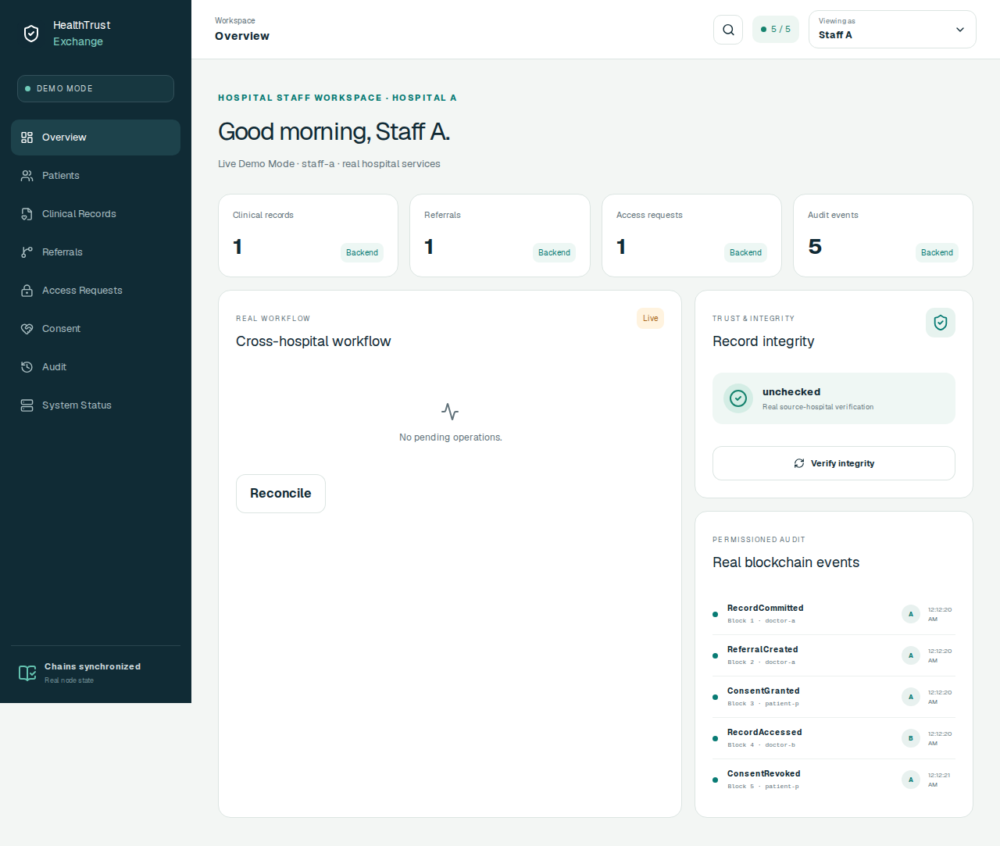

# HealthTrust Exchange

**A permissioned healthcare information exchange built in Go.**

Clinical records remain off-chain. Integrity and authorization events are auditable. Patients control cross-hospital access.

> Engineering prototype only. This project is not production-ready and makes no HIPAA, GDPR, FHIR, or other compliance claim.



## What is HealthTrust Exchange?

Clinical information is often fragmented across healthcare organizations. A patient may move from Hospital A to Hospital B while the source record remains siloed and its access history is difficult to inspect.

HealthTrust Exchange demonstrates how off-chain clinical storage, patient-controlled authorization, cryptographic identity, blockchain-backed integrity, and cross-hospital auditability can work together across independent organizations.

## The problem and approach

Hospital A owns the patient's clinical record. Hospital B may need it for referred care or after the same patient independently arrives as a walk-in. The source hospital must retain control, the patient must authorize access, and integrity and authorization decisions should be reviewable without placing sensitive clinical content on a blockchain.

- Hospital A stores clinical content in PostgreSQL.
- A SHA-256 integrity commitment is recorded on a shared permissioned blockchain.
- Hospital B requests access as a registered doctor.
- The patient grants or revokes exact cross-hospital consent.
- Hospital A independently validates peer identity, requester proof, role, replay state, and consent.
- Both nodes retain signed audit evidence.

## Architecture



See [Architecture](docs/ARCHITECTURE.md) for engineering detail.

## Two verified interoperability paths

- **Referral:** Hospital A sends real referral context; Hospital B requests access to its linked source record.
- **Walk-in discovery:** Hospital B registers the patient locally, then a signed trusted-peer request asks only whether Hospital A has records for the correlated network identity. Discovery returns a count and opaque record scopes, never clinical content. The doctor must separately request access and the patient must approve it.

Discovery is not authorization. Both paths converge on the same signed requester proof, scoped consent, source-hospital authorization, secure viewing, integrity verification, and revocation controls. Hospital B does not persist a copied Hospital A clinical row.



### Referral workflow



## Why blockchain here?

Blockchain does **not** store diagnoses, prescriptions, encounter summaries, or other clinical content. PostgreSQL is the appropriate clinical data store.

The custom permissioned chain demonstrates shared tamper-evident integrity and audit evidence across independently operated hospitals. On-chain events include record commitments, referrals, consent grants, consent revocations, and record accesses.

### Why not just PostgreSQL?

A conventional database is simpler and remains correct for many healthcare systems. This prototype uses separate PostgreSQL databases for clinical and operational data. The blockchain explores a narrower question: how independent organizations might validate the same signed audit history without putting one hospital's clinical database under another hospital's control. It does not imply every healthcare exchange needs blockchain.

## Security model

| Concern | Prototype control |
|---|---|
| Identity | Registered Ed25519 public keys, organizations, roles, status |
| Transactions | Ed25519 signatures |
| Hospital authentication | Signed peer envelopes bound to request details |
| Requester authentication | Short-lived signed requester proofs |
| Replay prevention | Durable PostgreSQL uniqueness constraints |
| Authorization | Role policy plus exact patient consent |
| Integrity | Canonical encoding and SHA-256 commitment |
| Reliability | Idempotency, deterministic event IDs, reconciliation |

Application-layer signatures do not replace production TLS/mTLS. See [Security](docs/SECURITY.md).

## Reliability and failure handling

- Database-first durable block writes and atomic block/transaction inserts
- Deterministic genesis and full restart reconstruction
- Missing-block synchronization with independent validation
- Idempotent workflow operations and deterministic audit IDs
- Pending-state reconciliation after partial failure
- Durable requester and peer replay prevention
- Nanosecond timestamp persistence for deterministic hashes

## Technology stack

- **Backend:** Go
- **Database:** PostgreSQL
- **Blockchain:** custom permissioned implementation
- **Cryptography:** Ed25519 and SHA-256
- **Frontend:** Next.js-compatible Vinext App Router, React, TypeScript, Tailwind CSS, Framer Motion
- **Infrastructure:** Docker and Docker Compose
- **Testing:** Go test, race detector, PostgreSQL integration tests, Node test runner, Playwright

## Product experience

<p align="center"></p>

<table><tr><td width="50%"></td><td width="50%"></td></tr><tr><td align="center">Patient-controlled access</td><td align="center">Record integrity</td></tr></table>

<table><tr><td width="50%"></td><td width="50%"></td></tr><tr><td align="center">Real blockchain events</td><td align="center">Synchronized nodes</td></tr></table>

See the [workflow story](docs/images/workflow.png) and [five-minute demo script](docs/DEMO.md).

## End-to-end demo

```text
Doctor A creates record → PostgreSQL A stores content → blockchain commits hash
→ referral to Hospital B → Doctor B requests access → DENIED
→ Patient P grants consent → Hospital A independently authorizes
→ Doctor B retrieves record → integrity verified → RecordAccessed audited
→ Patient P revokes consent → Doctor B denied again
```

This exact scenario runs through the UI against two real hospital nodes and two PostgreSQL databases in Playwright.

The Docker-backed Playwright suite also runs a no-referral walk-in scenario with different local patient IDs at the two hospitals, trusted discovery, approval, viewing, an independently owned Hospital B record, and post-revocation denial.

## Prototype patient identity correlation

Each hospital keeps its own local patient ID. A separate `NetworkPatientID` explicitly correlates those local registrations for this prototype; local IDs do not need to match. The identifier is not inferred from name, phone, or demographics and is not shown in the normal product UI. This is a deterministic demo mechanism—not a production master patient index, national identifier, authentication system, or claim of healthcare interoperability compliance.

## Quick start

Requirements: Docker Desktop (with Compose) and Git. The local PostgreSQL user,
password, databases, and deterministic signing identities in this repository are
synthetic development values only; never reuse them outside this demo.

```sh
cd healthtrust-exchange
docker compose up --build
```

- Frontend: `http://localhost:3000`
- Hospital A: `http://localhost:8081/health`
- Hospital B: `http://localhost:8082/health`

## Deterministic reset and E2E

> **Warning:** this removes the project's local Docker database volumes and all demo records in them.

```sh
cd web
npm ci
npx playwright install chromium
npm run e2e:clean
```

`e2e:clean` invokes the guarded `scripts/e2e-reset.sh` reset, rebuilds the normal
Docker-backed environment, and runs the complete Playwright suite. The reset
refuses to remove volumes unless `HEALTHTRUST_E2E_RESET=1`; the npm script sets
that guard explicitly. These commands require Node.js 22.13 or newer. For a manual disposable reset, run
`HEALTHTRUST_E2E_RESET=1 ./scripts/e2e-reset.sh` from the repository root.

## Testing

Backend:

```sh
gofmt -w cmd internal
go vet ./...
go test ./...
go test -race ./...
```

Frontend, from `web/` with Node.js 22.13 or newer and npm (using the committed
`package-lock.json`):

```sh
npm ci
npm run lint
npm run typecheck
npm test
npm run build
```

Real E2E against an existing Compose stack:

```sh
cd web
E2E_BASE_URL=http://localhost:3000 npm run e2e
```

For the deterministic clean-state run, prefer `npm run e2e:clean`. The Go suite
includes PostgreSQL integration tests when disposable test-database URLs are
configured. Never target important data.

## Repository structure

```text
cmd/                    runnable demos and hospital server
internal/blockchain/    blocks, transactions, hashing and validation
internal/identity/      organizations, actors, roles and registry
internal/authorization/ transaction and healthcare role policy
internal/clinical/      off-chain models and canonical hashing
internal/workflow/      records, referrals, consent, proofs and retrieval
internal/reliability/   idempotency and reconciliation
internal/security/      peer authentication and replay controls
internal/persistence/   storage contracts and PostgreSQL adapters
internal/node/          node state, block creation and synchronization
internal/transport/     HTTP handlers and peer client
migrations/             versioned PostgreSQL schema
web/                    product UI and real E2E
docs/                   architecture, security and portfolio material
```

## Roadmap

Completed: M1 Blockchain Core, M2 Identity & Authorization, M3 Multi-Hospital Network, M4 Persistence & Recovery, M5 Clinical Workflow, M6 Reliability & Security, and M7 Product UI.

Potential future exploration—not commitments—includes FHIR interoperability, production authentication, TLS/mTLS, managed PKI and secrets, historical key rotation, observability, deployment, IoT integration, and AI-assisted workflows.

## Project material

- [Architecture](docs/ARCHITECTURE.md)
- [Security](docs/SECURITY.md)
- [Demo script](docs/DEMO.md)
- [Portfolio copy](docs/PORTFOLIO.md)
- [Contributing](CONTRIBUTING.md)

## GitHub metadata

Suggested description: **Permissioned healthcare information exchange demonstrating patient-controlled cross-hospital access, blockchain-backed integrity, and auditable clinical data sharing.**

Suggested topics: `go`, `blockchain`, `healthcare`, `healthtech`, `distributed-systems`, `postgresql`, `nextjs`, `typescript`, `cryptography`, `interoperability`.

## License

No license has been selected. All rights remain with the repository owner unless a license is added.
