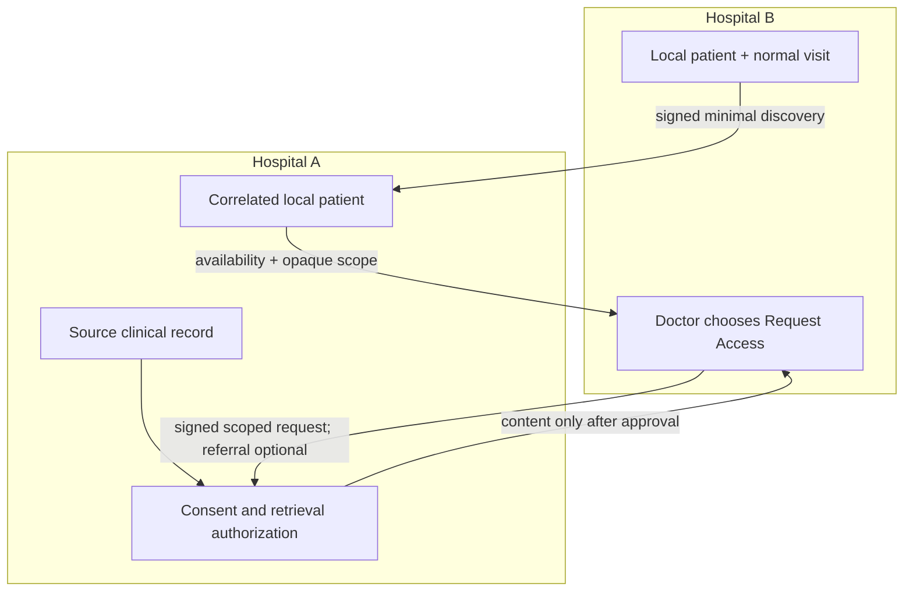
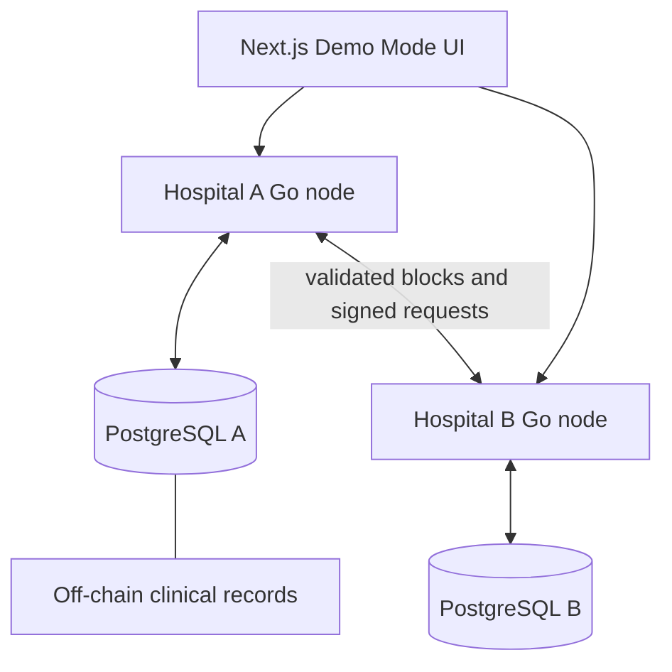

# HealthTrust Exchange architecture

This document expands on the engineering boundaries summarized in the [README](../README.md).

## System boundaries

Each hospital owns a Go node, PostgreSQL database, identity-registry view, blockchain copy, transaction pool, and peer configuration. Hospital A remains the source of truth for its clinical records. Hospital B never receives signing keys from the browser and never bypasses Hospital A authorization.

## Unified patient identity and entry paths

A patient is not marked as a special cross-hospital type. Each hospital has an organization-local patient row, and the prototype stores an explicit `network_patient_id` correlation value. For example, `patient-a-123` and `patient-b-891` may both map to `patient-network-001`. This mapping is explicit; the system does not guess identity from names or demographics. It is intentionally prototype-level and is not a production MPI or authentication design.

Cross-hospital access begins either with a real referral or with walk-in discovery. Walk-in discovery uses the existing signed peer envelope, trusted-node registry, timestamps, nonces, and durable replay consumption. Hospital A resolves the network identity locally and returns only availability, count, and opaque record scopes. The scope is bound to the correlated patient, source record, and requesting organization. It is not a record identifier and does not authorize retrieval.

Referral-backed requests retain their referral linkage. Walk-in requests store an empty referral link and instead carry source organization, network identity, opaque discovery scope, and purpose. No fake referral is created.

## Data plane and trust plane

The data plane stores encounter summaries, diagnoses, prescriptions, workflow state, replay records, and idempotency records in PostgreSQL. The trust plane contains signed blockchain transactions and blocks. It carries references and hashes, never raw clinical content.

## Blockchain, identity, and authorization

Blocks contain height, timestamp, previous hash, ordered signed transactions, and block hash. Transactions identify an event type, actor, organization, resource, payload hash, timestamp, public key, and Ed25519 signature. Nodes validate linkage, hashes, identity membership, active status, registered keys, signatures, roles, and transaction types before persistence.

Organizations and actors are recovered from PostgreSQL. Healthcare policy restricts which roles may produce each event. Source-side access additionally requires active consent matching patient, record, requesting doctor, and requesting organization.

## Persistence and recovery

A candidate block is validated before mutation. The block and ordered transactions are inserted atomically, then the same block is appended to memory. Startup applies migrations, loads identity state, verifies deterministic genesis compatibility, reconstructs every block, and fails closed on invalid durable state.

## Secure cross-hospital retrieval

1. The browser asks Hospital B to retrieve a record as Doctor B.
2. Hospital B signs a short-lived requester proof with Doctor B's demo key.
3. Hospital B signs a peer envelope bound to the complete request.
4. Hospital A verifies peer identity, expiry, body binding, and durable replay state.
5. Hospital A verifies Doctor B's identity, organization, role, and proof replay state.
6. Hospital A checks exact active patient consent and returns its off-chain record.
7. Hospital B records `RecordAccessed` on the shared chain.

Private signing keys remain server-side.

## Idempotency, reconciliation, and integrity

Mutation idempotency uses `(operation, key)` uniqueness plus canonical request hashes. Identical completed retries return the original result; altered payloads conflict. Pending records, referrals, and consents are reconciled by checking deterministic audit IDs and either finalizing local state or retrying the same event.

Record fields use a canonical length-prefixed encoding and SHA-256. Verification reloads the source record, recomputes the hash, and compares it with the stored commitment.

## Frontend/backend boundary

The frontend contains role selection and presentation state, not authoritative workflow state. Its typed API layer selects Hospital A or B, sends idempotency keys, refreshes after mutations, and polls lightweight reads. Demo identities are deterministic and explicit; they are not production authentication.
