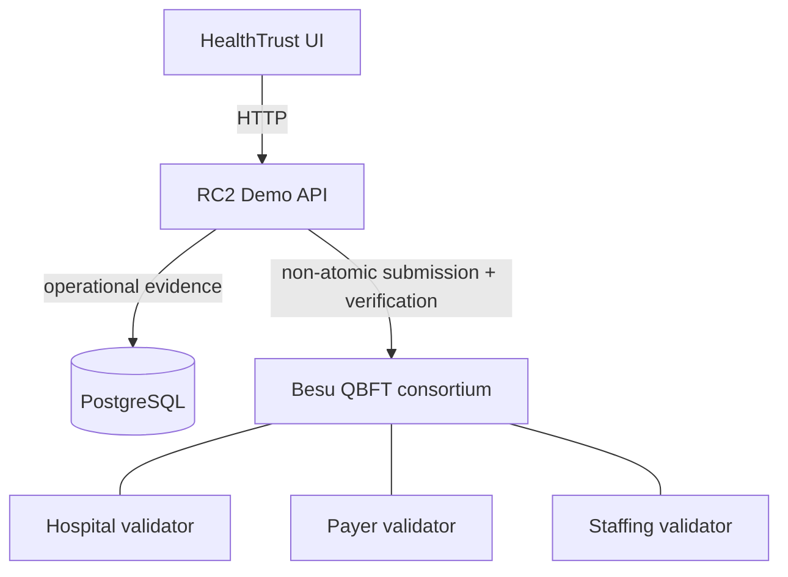

# RC2 demo runbook

This runbook presents the bounded HealthTrust RC2 professional-authority response
and integrity-detection workflow. Everything shown is synthetic. It is a portfolio
engineering demonstration, not a production healthcare, credentialing, or
compliance system.

## Pre-demo

### 1. Confirm prerequisites and ports

Use Docker with Docker Compose, Git, `curl`, Python 3, and Node.js 22.13 or newer
with npm. The presenter needs two terminals and a browser.

Browser-facing:

- `http://localhost:3000/authority` — HealthTrust UI
- `http://localhost:8090` — RC2 demo API

Loopback infrastructure (not browser endpoints):

- `127.0.0.1:5434` — PostgreSQL
- `127.0.0.1:8545`, `:8546`, `:8547` — Besu validator RPC

Confirm those ports are available before startup.

### 2. Create clean disposable state

From the repository root:

```sh
docker compose -f docker-compose.rc2.yml --profile demo-api down --volumes --remove-orphans
docker compose -f docker-compose.rc2.yml --profile demo-api up -d --wait \
  rc2-postgres besu-hospital-validator besu-payer-validator besu-staffing-validator
./contracts/scripts/deploy-local.sh
HEALTHTRUST_RC2_DEMO_TAMPER_ENABLED=true \
  docker compose -f docker-compose.rc2.yml --profile demo-api \
  up -d --build --wait rc2-demo-api
```

The first command permanently deletes only this disposable RC2 Compose project's
PostgreSQL and Besu volumes. Never point these procedures at retained data.

Startup order matters: PostgreSQL and the validators become healthy, contracts are
deployed to the clean chain, then the API validates the configured chain/contracts
and bootstraps the deterministic fixture. The API must not race the initial
contract deployment.

### 3. Verify the API and initial evidence

```sh
curl --fail http://localhost:8090/readyz
curl --fail --silent \
  http://localhost:8090/api/rc2/authority-events/EVENT-PHASE8/verification/bundle \
  | python3 -m json.tool
```

Expected pre-demo facts:

- readiness status is `ready`;
- event `EVENT-PHASE8` exists;
- the bundle and all three organizations are `VERIFIED`;
- all response streams have reached `ACTION_COMPLETED` and are confirmed;
- the controlled change has not yet run.

If the bundle is already `FAILED`, do not present it as clean. Follow **Environment
already FAILED** under Troubleshooting.

### 4. Start the frontend

In a second terminal:

```sh
cd web
npm ci
npm run dev
```

Open `http://localhost:3000/authority`. Keep both terminals available during the
demo. The default frontend API URL is `http://localhost:8090`, and the API's exact
allowed browser origin is `http://localhost:3000`.

## Demo

### Canonical UI journey and presenter notes

1. **Open Operations.** Point to the synthetic `EXCLUSION` event from
   `HHS-OIG-DEMO` concerning pseudonymous subject `PRV-7F31A`.
   Say: “One synthetic authority assertion has been ingested and recorded.”

2. **Compare the organization cards.** Open Hospital A, Payer B, and Staffing
   Agency C. Point out their independent response histories and outcomes:
   Scheduling disabled; Enrollment/reimbursement held; Assignment ended.
   Say: “The organizations see shared evidence but apply their own policies.”

3. **Point to the initial verification.** Each organization is `VERIFIED`.
   Say: “Current persisted canonical evidence matches what was previously
   recorded. This is an agreement check, not proof that the source was truthful.”

4. **Switch to Technical.** Show the three-validator deployment topology,
   confirmed transactions, blocks, and commitment comparisons.
   Say: “The browser talks to the Go API; the API reads PostgreSQL and separately
   submits and verifies bounded evidence through Besu.”

5. **Open Integrity Detection.** Choose **Simulate local policy change**.
   Read the confirmation boundary before continuing.
   Say: “This explicit demo-only operation changes one allowlisted synthetic
   Hospital A policy field in PostgreSQL. It does not write to or repair Besu.”

6. **Confirm the simulation.** Wait for authoritative verification to reload.
   Show Hospital A as `FAILED`, with Payer B and Staffing Agency C still
   `VERIFIED`.
   Say: “The database change was allowed. The previously recorded evidence was
   not rewritten. That made the inconsistency detectable.”

7. **Show unchanged recorded evidence.** Compare the pre-existing Hospital A
   ledger commitment and transaction/block metadata.
   Say: “Detection does not prevent mutation, prove which value is true, or
   identify an actor.”

8. **Refresh the page.** Return to Technical and Integrity Detection; Hospital A
   remains `FAILED`.
   Say: “This is backend state, not a temporary browser animation.”

### What not to claim

- Do not say blockchain prevents tampering. Say previously recorded evidence makes
  a later inconsistency detectable.
- Do not say blockchain proves truth. Say current persisted evidence is compared
  with prior recorded evidence.
- Do not say the network coordinates healthcare decisions. Each organization
  chooses its own response.
- Do not say a full response hash is on-chain. For Hospital A, the demo verifies
  the actual `PolicyV1` commitment stored in the response snapshot.
- Do not imply production security, compliance, OIG integration, organizational
  independence, adoption, or that blockchain is necessary.

## 30-second narrative

“HealthTrust RC2 asks whether distributing trust is worth the complexity when
organizations need the same evidence but retain independent authority. One
synthetic exclusion event is visible to a hospital, payer, and staffing agency;
each records a different local response. Their evidence initially verifies against
the shared ledger. I then allow one bounded local Hospital A policy change. The
earlier evidence is not rewritten, so Hospital A becomes inconsistent while the
other two organizations remain verified. This demonstrates mismatch detection—not
truth, mutation prevention, or coordinated decisions.”

## 3–5 minute narrative

### 1. Problem framing

“Healthcare organizations can need evidence about the same professional-authority
event without surrendering their independent policy and operational authority. RC2
explores whether a shared evidence layer helps in that boundary.”

### 2. Shared event

“This is a deterministic synthetic exclusion assertion: `EVENT-PHASE8`, from
`HHS-OIG-DEMO`, concerning pseudonymous subject `PRV-7F31A`. There is no real OIG
feed or practitioner data here.”

### 3. Independent responses

“Hospital A, Payer B, and Staffing Agency C build separate response histories.
Their demonstration outcomes differ because the ledger records evidence; it does
not make their decisions.”

### 4. Verification

“The initial `VERIFIED` state means current canonical evidence in PostgreSQL agrees
with the evidence previously recorded. It does not mean the original assertion or
organizational response was true or correct.”

### 5. Technical evidence

“The Vinext/React browser talks only to the Go API. PostgreSQL holds operational
detail. The API separately submits bounded identifiers and SHA-256 commitments to
a local three-validator Hyperledger Besu/QBFT consortium. These writes are not
atomic; durable submission state and reconciliation handle recoverable gaps.”

### 6. Controlled local change

“I am explicitly confirming a demo-only, allowlisted change to one synthetic
Hospital A policy field. This is not ordinary product editing and it does not alter
the ledger.”

### 7. Detected mismatch

“Hospital A now fails verification because its recomputed `PolicyV1` commitment no
longer matches the recorded policy commitment. Payer B and Staffing Agency C remain
verified, and the earlier transaction/block evidence is unchanged.”

### 8. Correct conclusion

“The database change was allowed. The previously recorded evidence was not
rewritten. That made the inconsistency detectable. RC2 is a bounded engineering
reference implementation—not a production platform, compliance claim, or proof
that healthcare requires blockchain.”

## Post-demo

### Verify API-restart persistence

The browser refresh already proves the status is authoritative. If the audience
needs the stronger restart demonstration, from the repository root run:

```sh
HEALTHTRUST_RC2_DEMO_TAMPER_ENABLED=true \
  docker compose -f docker-compose.rc2.yml --profile demo-api restart rc2-demo-api
docker compose -f docker-compose.rc2.yml --profile demo-api up -d --wait rc2-demo-api
```

Refresh the browser. Hospital A remains `FAILED` because the changed policy is
persisted in PostgreSQL and bootstrap deliberately does not repair it.

### Clean up or recreate

Stop the frontend with `Ctrl-C`, then remove the disposable RC2 environment:

```sh
docker compose -f docker-compose.rc2.yml --profile demo-api down --volumes --remove-orphans
```

To prepare another clean demonstration, repeat **Create clean disposable state**.
There is intentionally no reset/repair HTTP endpoint.

## Troubleshooting

### Frontend cannot reach the API

- Confirm `curl --fail http://localhost:8090/readyz` succeeds.
- Use exactly `http://localhost:3000/authority`; `127.0.0.1:3000` is a different
  browser origin from the API's default CORS allowlist.
- Confirm `NEXT_PUBLIC_RC2_API_URL` was not set to a container-only hostname. The
  browser default is `http://localhost:8090`.

### API is not ready

```sh
docker compose -f docker-compose.rc2.yml --profile demo-api ps
docker compose -f docker-compose.rc2.yml --profile demo-api logs rc2-demo-api
```

Confirm the validators and PostgreSQL are healthy and the clean-chain contract
deployment completed before the API was started.

### Controlled demonstration is disabled

A `403` response means the API was not recreated with the exact value `true`.
Run the mutation-enabled API startup command from **Create clean disposable state**.
Values such as `TRUE` or `1` intentionally remain disabled.

### Environment already FAILED

The controlled change persists across browser refresh and API restart. Stop the
frontend, remove the disposable RC2 volumes with the Post-demo cleanup command,
then repeat the complete Pre-demo startup. No repair endpoint exists.

### Fixture conflict

Bootstrap fails closed when it finds partial, unconfirmed, or structurally
unexpected fixed-fixture state. Inspect the API logs, then recreate the disposable
environment. Do not edit the fixture or database manually.

### Port collision

Stop the unrelated local process/container using `3000`, `8090`, `5434`, or
`8545`–`8547`. Do not change the documented port mapping immediately before a
presentation because the frontend origin, CORS configuration, scripts, and tests
expect these defaults.

### Stale disposable volumes or contract deployment nonce conflict

If contract deployment says the demo deployer nonce is not zero, the chain is not
clean. Run the Post-demo `down --volumes --remove-orphans` command and repeat the
full Pre-demo sequence. This is destructive only to the RC2 Compose project's
disposable demo state.

## Architecture and evidence boundary



Sensitive operational detail stays off-chain. The ledger contains bounded
pseudonymous identifiers, lifecycle values, timestamps, lineage, and commitments.
Application transaction signers and QBFT validator identities are separate. The
Technical view exposes safe observability; it is not a network administration UI.

For deeper detail, see [Architecture plan](ARCHITECTURE_PLAN.md),
[Demo runtime](DEMO_RUNTIME.md), [Integrity verification](INTEGRITY_VERIFICATION.md),
[Controlled tamper demo](CONTROLLED_TAMPER_DEMO.md), and
[Threat model](THREAT_MODEL.md).
