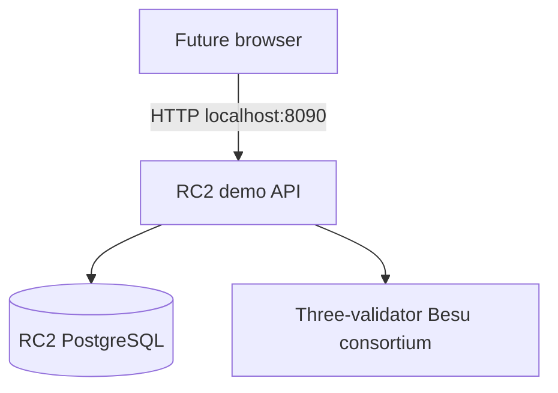

# RC2 deterministic demo runtime

Phase 8.5 provides an isolated, local-only executable composition of the frozen
Phase 4–8 authority workflow. It exists so a future Phase 9 browser can consume
real PostgreSQL and Besu-backed RC2 state. It does not change or replace the RC1
hospital nodes.



The browser never connects to Besu JSON-RPC. RC2 PostgreSQL is published only on host loopback port `5434` for integration tests.
Validator RPC is available only on
host loopback for local administration and tests; inside Compose the API uses the
private `besu-consortium` network. At startup, the API reads the frozen contract
configuration through a second validator before accepting the demo fixture.

## Executable and configuration

`cmd/rc2-demo-api` composes the existing Phase 6 workflow, Phase 7 verifier, and
Phase 8 `HandlerWithDemo`. `Dockerfile.rc2` builds only this runtime. Required
configuration is explicit:

- `HEALTHTRUST_RC2_DATABASE_URL`, migrations directory, listen address;
- primary and peer Besu RPC URLs and expected chain ID;
- all four frozen contract addresses;
- four application transaction signer keys;
- exact allowed browser origin;
- `HEALTHTRUST_RC2_DEMO_BOOTSTRAP_ENABLED` and
  `HEALTHTRUST_RC2_DEMO_TAMPER_ENABLED`.

Both demo gates are disabled by the executable unless their value is exactly
`true`. The explicit `docker-compose.rc2.yml` demo boundary enables bootstrap by
default and keeps tampering disabled. Its public deterministic application keys
come from `contracts/demo-accounts.env.example`; they are non-production test
material and are distinct from every QBFT validator key.

The future Phase 9 API base URL is `http://localhost:8090`. Development CORS is
limited to the configured exact origin, which defaults to `http://localhost:3000`
in the RC2 Compose file. There is no wildcard origin. Phase 9 may instead add a
same-origin frontend proxy later; this phase makes no frontend change.

## Start and reset

Contract deployment remains the explicit frozen Phase 3 mechanism. From the
repository root, create a clean disposable environment and start the API:

```bash
docker compose -f docker-compose.rc2.yml down --volumes
docker compose -f docker-compose.rc2.yml up -d --wait \
  rc2-postgres besu-hospital-validator besu-payer-validator besu-staffing-validator
./contracts/scripts/deploy-local.sh
docker compose -f docker-compose.rc2.yml --profile demo-api up -d --build --wait rc2-demo-api
curl --fail http://localhost:8090/readyz
```

The profile preserves the original Besu-only Compose workflow and prevents the
API from racing an explicit first contract deployment. Fixed deployment addresses
are supplied to the API and validated with chain access during initialization.

To enable the only deliberate mutation route, recreate the disposable API with:

```bash
HEALTHTRUST_RC2_DEMO_TAMPER_ENABLED=true \
  docker compose -f docker-compose.rc2.yml --profile demo-api \
  up -d --force-recreate --wait rc2-demo-api
```

Reset means removing only the RC2 Compose volumes and redeploying as shown above.
This destroys local RC2 PostgreSQL and chain history and does not touch RC1.
There is no repair, deployment, arbitrary SQL, generic RPC, or validator-
administration HTTP endpoint. The frozen Phase 6 reconciliation routes remain
mounted, but they operate only on known persisted submission records; Phase 8.5
adds no broader reconciliation or administration capability.

## Deterministic fixture and restart rules

With bootstrap enabled, startup ensures the synthetic authority, pseudonymous
subject, and three organizations exist with the exact expected metadata. If
`EVENT-PHASE8` is absent, the existing Phase 6 application service creates the
event and independently advances Hospital A, Payer B, and Staffing Agency C
through `RECEIVED -> UNDER_REVIEW -> DECIDED -> ACTION_COMPLETED`. Every version
is submitted through the existing durable submission service.

On restart, bootstrap inspects the complete fixture, response lineage, detail
references, confirmed transaction/block evidence, and verification result. A
complete clean fixture is reused without a write. The two exact Phase 8 controlled
mutations are also recognized and preserved; bootstrap never resubmits or repairs
their mismatch. Partial, structurally conflicting, unconfirmed, or otherwise
unexpected fixture state fails closed.

Run the destructive disposable-environment smoke test with:

```bash
./scripts/rc2-runtime-smoke.sh
```

It proves HTTP availability, three response histories, clean `VERIFIED` status,
default-disabled mutation, duplicate-free clean restart, deliberate Hospital A
`VERIFIED -> FAILED`, unaffected peer organizations, unchanged recorded evidence,
and mismatch preservation after restart.

## Security limitations and non-claims

This is a local portfolio demonstration with public deterministic demo accounts,
unauthenticated API endpoints, loopback-only unauthenticated Besu RPC, and a
single Docker host. It does not provide production authentication, RBAC, secrets
management, network hardening, backup/recovery, independent organizational
custody, practitioner validation, regulatory compliance, market validation, or
proof that blockchain is necessary. Ledger commitments prove only that the
configured demo signer recorded the committed evidence at a chain position.
